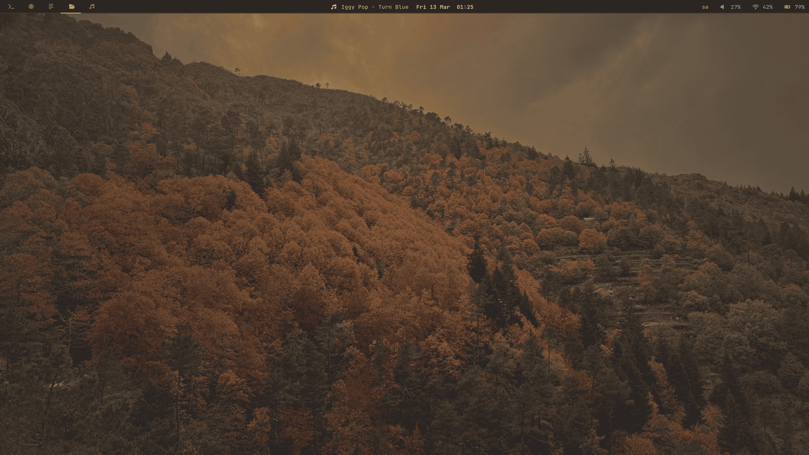

# dotfiles

configuration files organized by machine.

## machines

| name | hardware | os | status |
|------|----------|----|--------|
| **Daisydot** | Lenovo IdeaPad 5 14ABA7 (Ryzen 5 5625U, 14GB, 512GB NVMe) | Fedora 43 / Sway | active |
| **dotHQ** | Beelink SER6 PRO | Fedora 42 | active |
| **JayJay@NordHealth** | ThinkPad X1 Nano | Windows 11 Pro | work |

## daisydot



gruvbox material dark everywhere. sway + waybar + rofi + dunst.

```
daisydot/
├── .zshrc
├── .config/
│   ├── sway/config
│   ├── waybar/config
│   ├── waybar/style.css
│   ├── rofi/config.rasi
│   ├── rofi/gruvbox-material.rasi
│   ├── dunst/dunstrc
│   ├── foot/foot.ini
│   ├── ghostty/config
│   └── starship/starship.toml
└── wallpaper/
    └── covilhabg_gruvbox.jpg
```

shell: zsh + starship + atuin + zoxide + fzf + eza + bat + fd + dust + btop
terminal: ghostty (primary), foot (backup)
launcher: rofi
notifications: dunst

---


